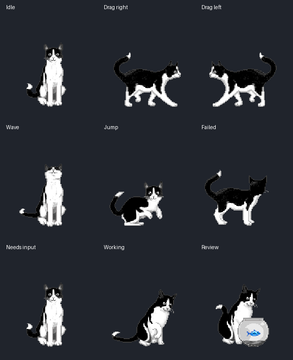
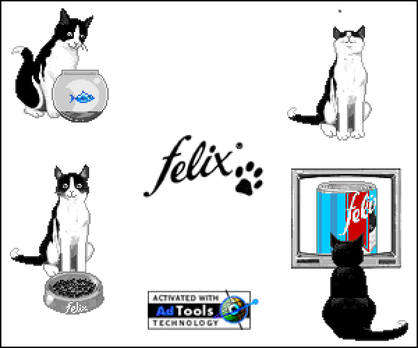

# Felix for Codex

The classic black-and-white desktop cat, repackaged as a Codex pet using his
original animation frames. All nine Codex states are included.

**[Download Felix](https://github.com/Szendvics/felix-codex-pet/releases/latest/download/felix-codex-pet.zip)**
· [Release notes](https://github.com/Szendvics/felix-codex-pet/releases/latest)

[Browse all 29 GIFs and choose the Codex state mapping](animations/README.md).
The gallery includes numbered source frames and a state selection template.



## Install

1. Download **felix-codex-pet.zip** from the release above. Sign in to GitHub with
   access to this private repository. Choose this asset, not GitHub's **Source code** ZIP.
2. Extract the ZIP. On Windows, right-click it and choose **Extract All**.
3. In Codex, open **Settings → Pets → Open folder**.
4. Copy the extracted **felix** folder into that folder.
5. Click **Refresh**, choose **Felix**, and enter `/pet` to show him.

Installation needs no Python, Git, terminal commands, or administrator access.
Older app versions place Pets under Appearance. If **Open folder** is unavailable,
copy the extracted folder to the matching location below:

- Linux/macOS: `~/.codex/pets/felix/`
- Windows: `%USERPROFILE%\.codex\pets\felix\`
- Custom Codex home: `$CODEX_HOME/pets/felix/`

The final layout must be `pets/felix/pet.json` and `pets/felix/spritesheet.webp`.
The archive also includes `felix/NOTICE.md`. Avoid an extra nested `felix` folder.

To update, replace the files in the existing `felix` folder and click **Refresh**.

When using Windows with WSL, install in the home directory used by the app that
displays the pet. The Windows app and WSL CLI can have separate Codex homes.

See the [official pet guide](https://learn.chatgpt.com/docs/pets) for the app controls.

## Animations

| Codex state | Felix's action |
| --- | --- |
| Idle | Same seated poses as Waiting for input (325), with Codex's idle timing |
| Drag right / left | Walking in the matching direction |
| Waving | Raising a paw |
| Jumping | Jumping and leaving paw prints on the glass (319) |
| Failed | Sitting with his back turned and moving his tail (322) |
| Waiting for input | Looking at you and moving his tail |
| Working | Eating from his bowl (311) |
| Review | Inspecting the fish bowl (315) |

This package uses the v1 atlas: 8 × 9 cells of 192 × 208 pixels, with transparent
unused cells. The app controls the pet's activity; the original desktop program's
window detection and roaming behavior are not part of the package.

Codex desktop 26.930.4958.0 uses one fixed six-frame Working row; custom pet
packages cannot choose a different Working animation on each turn.

## Rebuild and check

```sh
python3 -m venv .venv
.venv/bin/python -m pip install -r requirements.txt
.venv/bin/python build.py
```

The build checks source checksums, frame bounds, and animation variation, then
runs OpenAI's atlas validator. It also writes `qa/contact-sheet.png`,
`qa/validation.json`, and `preview.gif` for visual inspection, plus
`dist/felix-codex-pet.zip` and its `.sha256` checksum for release downloads.
The ZIP is checked against the source files and uses fixed timestamps for
repeatable packaging. On Windows, use `.venv\Scripts\python.exe` instead.

Frame choices and timing are in `build.py`. Every pose uses the same scale;
positions preserve each source sheet's baseline. Walking directions were checked
against the actual frames because the archive labels them in reverse.

## Original Felix artwork



See [NOTICE.md](NOTICE.md) for original asset and validator credits.
