# Felix GIF selector

Browse all 29 sequences below. Click a frame count to see the numbered frames.

## Current selection

| Codex state | Sequence | Frames, in playback order |
| --- | ---: | --- |
| `idle` | 325 | 2, 3, 4, 5, 6, 3 |
| `running-right` | 303 | 0, 2, 3, 5, 6, 8, 9, 11 |
| `running-left` | 302 | 0, 2, 3, 5, 6, 8, 9, 11 |
| `waving` | 325 | 7, 9, 10, 13 |
| `jumping` | 319 | 2, 3, 4, 5, 8 |
| `failed` | 322 | 0, 1, 2, 4, 6, 8, 10, 11 |
| `waiting` (Needs input) | 325 | 2, 3, 4, 5, 6, 3 |
| `running` (Working) | 311 | 14, 15, 16, 17, 16, 15 |
| `review` | 315 | 4, 6, 8, 12, 19, 21 |

To request a change, use a sequence ID (`idle=325`) or a frame range
(`idle=325:2-6` for frames 2 through 6). Frame numbers start at zero.
The selection lives in `ROWS` in [build.py](../build.py).

## Preview notes

- GIFs show the full source sheets in order, at 2× size and 120 ms per frame.
  This preview speed differs from the installed pet.
- Some sequences jump back to the start when they loop.
- 312–314 are fish props, 317 is a head fragment, and 326–328 are moving dots.
- 1200 is the original splash image.

Regenerate the gallery: `.venv/bin/python export_gifs.py`.

[Sources and attribution](../NOTICE.md)

## All GIFs

<!-- generated gallery -->

| ID · sequence | Frames | GIF |
| --- | --- | --- |
| **301** · Landing and standing up | [4 (0–3)](fig_301.frames.png) | 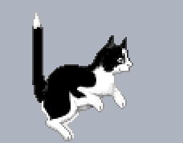 |
| **302** · Walking left | [12 (0–11)](fig_302.frames.png) | 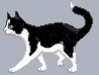 |
| **303** · Walking right | [12 (0–11)](fig_303.frames.png) | 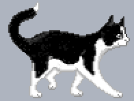 |
| **304** · Turning right | [2 (0–1)](fig_304.frames.png) | 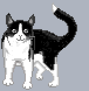 |
| **305** · Turning left | [2 (0–1)](fig_305.frames.png) | 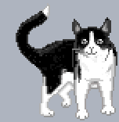 |
| **306** · Sitting down, looking around, standing up | [12 (0–11)](fig_306.frames.png) | 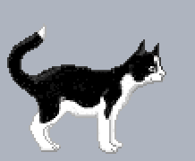 |
| **307** · Sitting sideways | [4 (0–3)](fig_307.frames.png) | 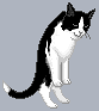 |
| **308** · Peeking up from below | [8 (0–7)](fig_308.frames.png) | 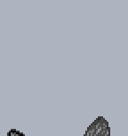 |
| **309** · Peeking in from the side | [8 (0–7)](fig_309.frames.png) | 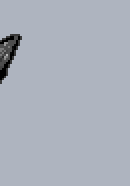 |
| **310** · Disappearing below the screen | [5 (0–4)](fig_310.frames.png) | 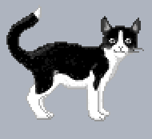 |
| **311** · Eating from the bowl | [24 (0–23)](fig_311.frames.png) | 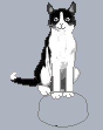 |
| **312** · Fish A | [34 (0–33)](fig_312.frames.png) | 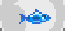 |
| **313** · Fish B | [22 (0–21)](fig_313.frames.png) | 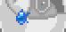 |
| **314** · Fish C | [8 (0–7)](fig_314.frames.png) | 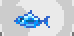 |
| **315** · Cat with a fish bowl | [24 (0–23)](fig_315.frames.png) | 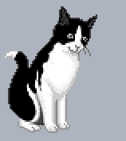 |
| **316** · Going through the cat flap | [26 (0–25)](fig_316.frames.png) | 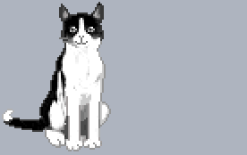 |
| **317** · Head at the screen edge | [4 (0–3)](fig_317.frames.png) | 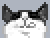 |
| **318** · Coming out of the cat flap | [23 (0–22)](fig_318.frames.png) | 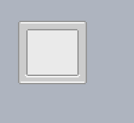 |
| **319** · Jumping, paw prints on the glass | [9 (0–8)](fig_319.frames.png) | 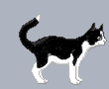 |
| **320** · Sitting and turning his head | [12 (0–11)](fig_320.frames.png) | 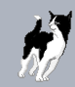 |
| **321** · Crouching with ears back and moving the tail | [32 (0–31)](fig_321.frames.png) | 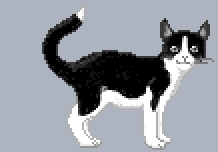 |
| **322** · Turning away, sitting down, moving the tail | [12 (0–11)](fig_322.frames.png) | 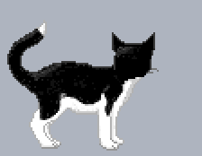 |
| **323** · Watching TV | [12 (0–11)](fig_323.frames.png) | 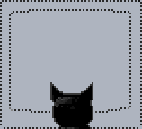 |
| **324** · Grooming and licking a paw | [20 (0–19)](fig_324.frames.png) | 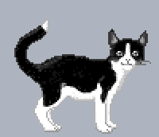 |
| **325** · Sitting and raising a paw | [18 (0–17)](fig_325.frames.png) | 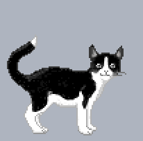 |
| **326** · Moving dots A | [32 (0–31)](fig_326.frames.png) | 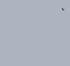 |
| **327** · Moving dots B | [13 (0–12)](fig_327.frames.png) | 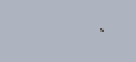 |
| **328** · Moving dots C | [14 (0–13)](fig_328.frames.png) | 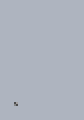 |
| **1200** · Splash screen and logo | [1 (0–0)](fig_1200.frames.png) |  |
